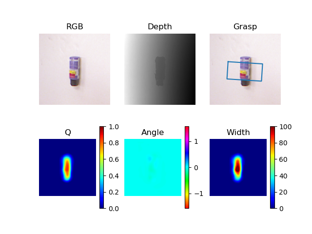
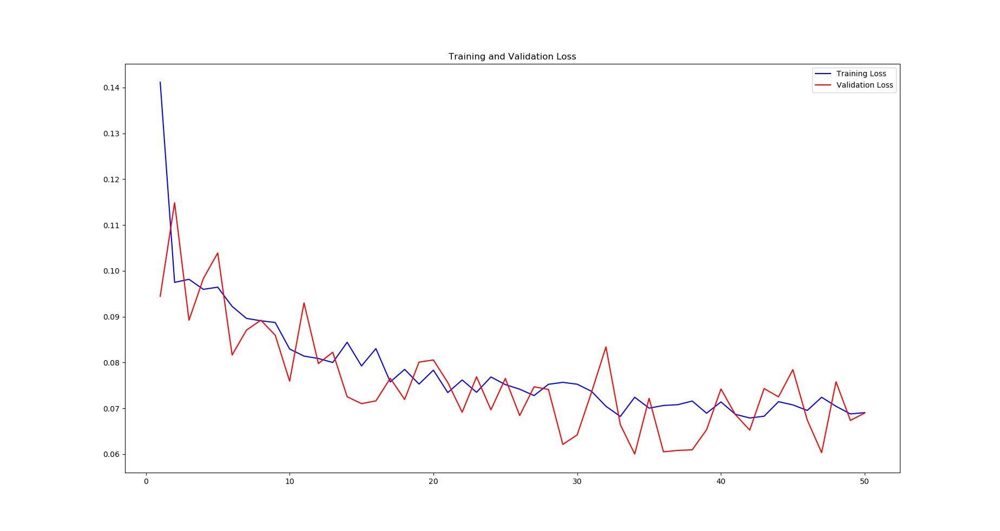

# Deep Robotic Grasping using Generative Residual Convolutional Neural Network

A CNN (GR-ConvNet) model that can generate robust antipodal grasps from RGB-D input images at real-time


## Setup
- Clone this repository and install required libraries
```
git clone https://github.com/Loahit5101/GR-ConvNet-grasping.git
cd robotic-grasping
pip install -r requirements.txt
```
- Install [TensorRT](https://docs.nvidia.com/deeplearning/tensorrt/install-guide/index.html) and [Torch-TensorRT](https://github.com/pytorch/TensorRT)
## Dataset

Download and extract the Cornell Grasping dataset and run the following command: [Cornell Grasping Dataset](https://www.kaggle.com/oneoneliu/cornell-grasp)
```
python -m utils.dataset_processing.generate_cornell_depth <Path To Dataset>
````
## Training
```
python train.py
````
## Testing
```
python test.py
````
## Model Optimization using TensorRT
- Post-training quantization
```
python ptq.py
````
- Benchmarking grasp inference time of optimized and unoptimized models
```
python trt_benchmark.py
````
## Results




Average Grasp Inference Time
|     Model     |   Time (ms)   | Accuracy | 
| ------------- |:-------------:|:--------:| 
| Baseline      |     4.59        |     95.5     |
| FP-32         |     3.71           |   94.2       | 
| FP-16          |    1.45      |       93.16   |

Post-processing time = 14 ms on average


## References
1. [Antipodal Robotic Grasping using GR-ConvNet](https://github.com/skumra/robotic-grasping)
2. [Pytorch-TensorRT Tutorials](https://github.com/pytorch/TensorRT/tree/master/examples)


